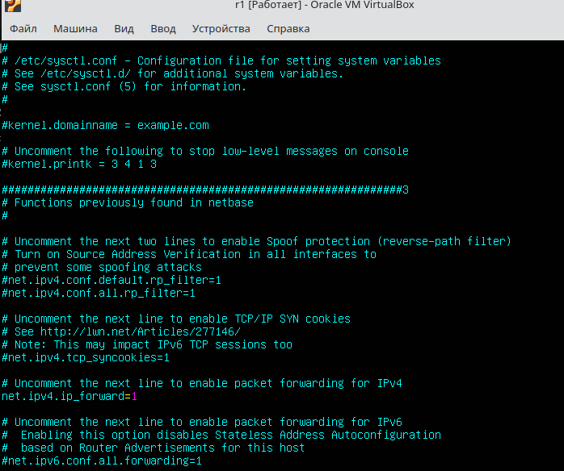
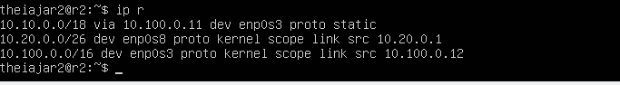
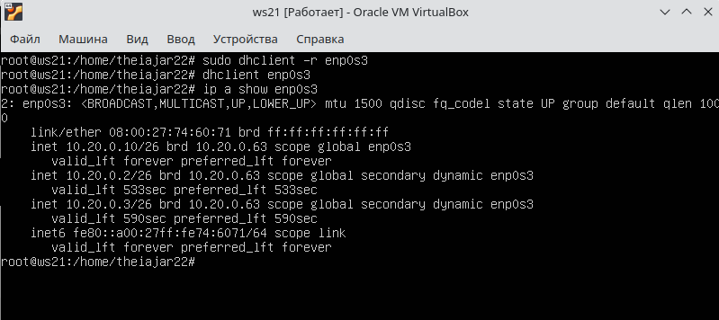
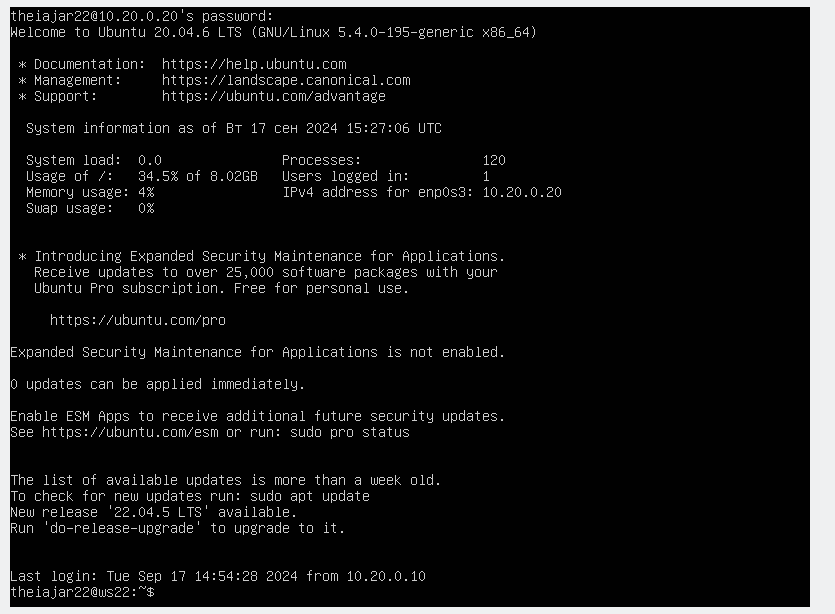

## Part 1. Инструмент **ipcalc**

- Поднял виртуальную машину (ws1)

#### 1.1. Сети и маски

- 1) Адрес сети *192.167.38.54/13*:

- 2) Перевод маски *255.255.255.0* в префиксную и двоичную запись, */15* в обычную и двоичную, *11111111.11111111.11111111.11110000* в обычную и префиксную

`255:`

`/15`

`11111111.11111111.11111111.11110000`

- 3) Минимальный и максимальный хост в сети *12.167.38.4* при масках: */8*, *11111111.11111111.00000000.00000000*, *255.255.254.0* и */4*

`12.167.38.4/8`

    -Hostmin 12.0.0.1 | 00001100.00000000.00000000.00000000
    -Hostmax 12.255.255.254 | 00001100.11111111.11111111.11111111

`111111111.11111111.00000000.00000000`

    -Hostmin 12.167.0.1 | 00001100.10100111.00000000.00000001
    -Hostmax 12.255.255.254 | 00001100.10100111.11111111.11111110

`255.255.254.0`

    -Hostmin 12.167.38.1 | 00001100.10100111.00000000.00000001
    -Hostmax 12.167.39.254 | 00001100.10100111.00100111.11111110

`12.167.38.4/4`

    -Hostmin 0.0.0.1 | 00000000.00000000.00000000.00000001
    -Hostmax 15.225.255.254 | 00001111.11111111.11111111.11111110

#### 1.2. localhost

- Определил и записал в отчёт, можно ли обратиться к приложению, работающему на localhost, со следующими IP: *194.34.23.100*, *127.0.0.2*, *127.1.0.1*, *128.0.0.1*

Можно обратиться:

    - 127.0.0.2
    - 127.1.0.1

Нельзя обратиться:

    - 194.34.23.100
    - 128.0.0.1

(Так как localhost находится в диапазоне 127.0.0.1 — 127.255.255.254)

#### 1.3. Диапазоны и сегменты сетей

- Диапозон частных сетей

    10.0.0.0 — 10.255.255.255 
    100.64.0.0 — 100.127.255.255 
    172.16.0.0 — 172.31.255.255 
    192.168.0.0 — 192.168.255.255 

`все остальное публичные сети`

##### Частные

    - 10.0.0.45 
    - 172.20.250.4
    - 192.168.4.2
    - 172.16.255.255 
    - 10.10.10.10
    - 172.20.250.4 

##### Публичные

    - 134.43.0.2 
    - 192.169.168.1
    - 172.68.0.2 
    - 192.172.0.1
    - 192.169.168.1
    - 172.0.2.1

##### 2) Какие из перечисленных IP-адресов шлюза возможны у сети *10.10.0.0/18*: *10.0.0.1*, *10.10.0.2*, *10.10.10.10*, *10.10.100.1*, *10.10.1.255*

`диапазон 10.10.0.1-10.10.63.254`

    - 10.10.0.2 - подходит

    - 10.10.10.10 - подходит

    - 10.10.1.255 - подходит

## Part 2. Статическая маршрутизация между двумя машинами

- Поднял две виртуальные машины (ws1 и ws2).

##### С помощью команды `ip a` посмотрел существующие сетевые интерфейсы.

`ws1`

`ws2`

##### Изменил содержание изменённого файла *etc/netplan/00-installer-config.yaml* для каждой машины.

`ws1`

`ws2`

\
##### Выполнил команду `netplan apply` для перезапуска сервиса сети.

`ws1`

`ws2`

#### 2.1. Добавление статического маршрута вручную

- Добавил статический маршрут от одной машины до другой и обратно при помощи команды вида `ip r add`.

`ws1`

`ws2`

- Пропинговал соединение между машинами.

`ws1`

`ws2`

#### 2.2. Добавление статического маршрута с сохранением

- Перезапустил машины.

- Добавил статический маршрут от одной машины до другой с помощью файла */etc/netplan/00-installer-config.yaml*.

`ws1`

`ws2`

- Пропинговал соединение между машинами.

`ws1`

`ws2`

## Part 3. Утилита **iperf3**

#### 3.1. Скорость соединения

        8 Mbps =  1 MB/s, 
        100 MB/s * 1000 * 8 = 800000 Kbps, 
        1 Gbps * 1000 = 1000 Mbps.

#### 3.2. Утилита **iperf3**

##### Измерил скорость соединения между ws1 и ws2.src/image/ws1_ws2_speed.png

## Part 4. Сетевой экран

#### 4.1. Утилита **iptables**
- Создал файл */etc/firewall.sh*, имитирующий файрвол, на ws1 и ws2:

##### Добавил в файл подряд следующие правила:

        1) На ws1 применил стратегию, когда в начале пишется запрещающее правило, а в конце пишется разрешающее правило 
        2) На ws2 применил стратегию, когда в начале пишется разрешающее правило, а в конце пишется запрещающее правило
        3) Открыл на машинах доступ для порта 22 (ssh) и порта 80 (http).
        4) Запретил *echo reply* 
        5) Разрешил *echo reply*

##### Запустл файлы на обеих машинах командами `chmod +x /etc/firewall.sh` и `/etc/firewall.sh`.

        `Разница стратегий заключается в том что с ws1 можно пропинговать ws2, а с ws2 пропинговать ws1 уже не получиться`
        `Чем выше правило, тем выше приоритет`

#### 4.2. Утилита **nmap**

- Командой **ping** нашел машину, которая не «пингуется»

`ей оказалась ws1`

- применил утилиту **nmap**, чтобы показать, что хост машины запущен.

## Part 5. Статическая маршрутизация сети

`-` Пока что мы соединяли всего две машины, но теперь пришло время для статической маршрутизации целой сети.

**== Задание ==**

Сеть: 

##### Поднял пять виртуальных машин (3 рабочие станции (ws11, ws21, ws22) и 2 роутера (r1, r2)).

#### 5.1. Настройка адресов машин

- Настроил конфигурации машин в *etc/netplan/00-installer-config.yaml* согласно сети на рисунке.

`ws11`

`r1`

`r2`

`ws21`

`ws22`

- Командой `ip -4 a` проверил, что адрес машины задан верно.

`r2, r1`

`ws21, ws22`

`ws11`

- Пропинговал ws22 с ws21 и r1 с ws11.

`r1 - ws11`

`ws21 - ws22`

#### 5.2. Включение переадресации IP-адресов

- Для включения переадресации IP выполнил команду на роутерах `sysctl -w net.ipv4.ip_forward=1`

`r1`

`r2`

- Открыл файл */etc/sysctl.conf* и добавил в него следующую строку `net.ipv4.ip_forward = 1`

`r1`

`r2`

*При использовании этого подхода, IP-переадресация включена на постоянной основе.*

#### 5.3. Установка маршрута по умолчанию

- Настроил маршрут по умолчанию (шлюз) для рабочих станций. Для этого добавь `default` перед IP-роутера в файле конфигураций.

`ws21/ws22`

`ws21`

- Вызовал `ip r`, чтобы проверить что добавился маршрут в таблицу маршрутизации.

- Пропинговал с ws11 роутер r2 и показал на r2, что пинг доходит. Для этого использовал команду: `tcpdump -tn -i eth0`

#### 5.4. Добавление статических маршрутов

- Добавил в роутеры r1 и r2 статические маршруты в файле конфигураций.

`r1`

`r2`

- Вызовал `ip r` и показал таблицы с маршрутами на обоих роутерах

`r1`

`r2`

- Запустил команды на ws11:

`ip r list 10.10.0.0/[маска сети]` and `ip r list 0.0.0.0/0`

- Был выбран маршрут, отличный от 0.0.0.0/0, поскольку он является адресом сети и доступен без шлюза.

#### 5.5. Построение списка маршрутизаторов

- Запустил на r1 команду дампа `tcpdump -tnv -i enp0s3`

- При помощи утилиты **traceroute** пострил список маршрутизаторов на пути от ws11 до ws21.

- Команда traceroute linux использует UDP пакеты. Она отправляет пакет с TTL=1 и смотрит адрес ответившего узла, дальше TTL=2, TTL=3 и так пока не достигнет цели. Каждый раз отправляется по три пакета и для каждого из них измеряется время прохождения. Когда утилита traceroute получает сообщение от целевого узла о том, что порт недоступен трассировка считается завершенной.

#### 5.6. Использование протокола **ICMP** при маршрутизации

- Пропинговал с ws11 несуществующий IP (например, *10.30.0.111*) с помощью команды:

`ping -c 1 10.30.0.111`

## Part 6. Динамическая настройка IP с помощью **DHCP**

##### Для r2 настроил в файле */etc/dhcp/dhcpd.conf* конфигурацию службы **DHCP**:

- 1) Укажи адрес маршрутизатора по умолчанию, DNS-сервер и адрес внутренней сети:

- 2) В файле *resolv.conf* прописал `nameserver 8.8.8.8`.

- Перезагрузил службу **DHCP** командой `systemctl restart isc-dhcp-server`. Машину ws21 перезагрузи при помощи `reboot` и через `ip a` покажи, что она получила адрес.

- Также пропинговал ws22 с ws21.

##### Указал MAC-адрес у ws11, для этого в *etc/netplan/00-installer-config.yaml* надо добавить строки: `macaddress: 10:10:10:10:10:BA`, `dhcp4: true`.

##### Для r1 настрой аналогично r2, но сделай выдачу адресов с жесткой привязкой к MAC-адресу (ws11). Проведи аналогичные тесты.

`dhcpd`

`resolve`

`ip a`

##### Запроси с ws21 обновление IP-адреса.

`ДО`

`ПОСЛЕ`

        Команда `sudo dhclient -r enp0s3` освобождает текущий адрес интерфейса enp0s3. Команда `sudo dhclient enp0s3` задает новый адрес указанному интерфейсу.

## Part 7. **NAT**

##### В файле */etc/apache2/ports.conf* на ws22 и r1 изменил строку `Listen 80` на `Listen 0.0.0.0:80`.

`ws21`

:

`r1`

##### Запустил веб-сервер Apache командой `service apache2 start` на ws22 и r1.

##### Добавил в фаервол, созданный по аналогии с фаерволом из Части 4, на r2 следующие правила:

        1) Удаление правил в таблице filter — `iptables -F`;
        2) Удаление правил в таблице «NAT» — `iptables -F -t nat`;
        3) Отбрасывать все маршрутизируемые пакеты — `iptables --policy FORWARD DROP`.

- Запустил файл также, как в Части 4.

- Проверил соединение между ws22 и r1 командой `ping`.

*При запуске файла с этими правилами, ws22 не должна «пинговаться» с r1.*

##### Добавил в файл ещё одно правило:

         4) Разрешить маршрутизацию всех пакетов протокола **ICMP**.-

- Запустил файл также, как в Части 4.

- Проверил соединение между ws22 и r1 командой `ping`.

*При запуске файла с этими правилами, ws22 должна «пинговаться» с r1.*

##### Добавил в файл ещё два правила:

     5) Включил **SNAT**, а именно маскирование всех локальных IPиз локальной сети, находящейся за r2 (по обозначениям из Части 5 — сеть 10.20.0.0).
     6) Включил **DNAT** на 8080 порт машины r2 и добавить к веб-серверу Apache, запущенному на ws22, доступ извне сети.

- Запустил файл также, как в Части 4.

- Проверил соединение по TCP для **SNAT**: для этого с ws22 подключиться к серверу Apache на r1 командой: `telnet [адрес] [порт]`

- Проверил соединение по TCP для **DNAT**: для этого с r1 подключиться к серверу Apache на ws22 командой `telnet` (обращаться по адресу r2 и порту 8080).

## Part 8. Дополнительно. Знакомство с **SSHclea Tunnels**

- Запустил на r2 фаервол с правилами из Части 7.

- Запустил веб-сервер **Apache** на ws22 только на localhost (то есть в файле */etc/apache2/ports.conf* изменил строку `Listen 80` на `Listen localhost:80`).

- Воспользовался *Local TCP forwarding* с ws21 до ws22, чтобы получить доступ к веб-серверу на ws22 с ws21.

использвовал - `ssh -L 8888:localhost:80 theiajar22@10.20.0.20`

- Воспользовался *Remote TCP forwarding* c ws11 до ws22, чтобы получить доступ к веб-серверу на ws22 с ws11.

- Для проверки, сработало ли подключение в обоих предыдущих пунктах, во втором терминале выполнил команду: `telnet 127.0.0.1 [локальный порт]`

